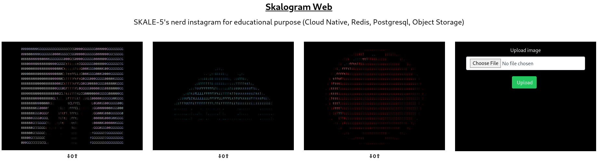

# SKALOGRAM

Education purpose Nerds Instagram Clone

## Level 0 - Command Line App

Skalogram Cli App allows you to print any image directly to the terminal and ask you if you like it. Votes are localy stored in JSON database.


### Usage
```
$ ./skalogram-cli -help
Usage of ./skalogram-cli:
  -db-path string
        path to the skalogram database (default "./.db.json")
  -image string
        path to the image you want to print (required)
```

### Download

Compiled binaries are available in the [releases page](https://github.com/skale-5/skalogram/releases)

Dont forget to make binary executable: `chmod +x skalogram-cli`

### Compile

```
$ cd cli/
mkdir build/
export GOOS=linux   && export GOARCH=amd64 && go build -o "build/skalogram-cli_${GOOS}_${GOARCH}"
export GOOS=linux   && export GOARCH=386   && go build -o "build/skalogram-cli_${GOOS}_${GOARCH}"
export GOOS=darwin  && export GOARCH=amd64 && go build -o "build/skalogram-cli_${GOOS}_${GOARCH}"
export GOOS=darwin  && export GOARCH=arm64 && go build -o "build/skalogram-cli_${GOOS}_${GOARCH}"
export GOOS=windows && export GOARCH=amd64 && go build -o "build/skalogram-cli_${GOOS}_${GOARCH}.exe"
export GOOS=windows && export GOARCH=386   && go build -o "build/skalogram-cli_${GOOS}_${GOARCH}.exe"

$ ./skalogram-cli -help
Usage of ./skalogram-cli:
  -db-path string
        path to the skalogram database (default "./.db.json")
  -image string
        path to the image you want to print (required)
```

## Level Super Skaler - Web Application

Skalogram Web App is the networked version of Skalogram CLI, allowing:

* Concurrent and remote Access
* Image caching



### Usage
```
$ ./skalogram-web -help
Usage of ./skalogram-web:
  -print-defaults
        Print default configurations
```

This application is only configurable by ENV VARS:

```
Default configurations:
        CACHE_TTL="60s"
        LISTEN_ADDR="0.0.0.0"
        LISTEN_PORT="8080"
        PG_DBNAME="skalogram"
        PG_HOST="127.0.0.1"
        PG_PASSWORD="postgres"
        PG_PORT="5432"
        PG_USER="postgres"
        REDIS_HOST="127.0.0.1"
        REDIS_PORT="6379"
        STORAGE_BUCKET="skalogram-posts-dev"
        STORAGE_BUCKET_REGION="eu-west3"
        STORAGE_TYPE="s3" ["s3","gs"]
```

Object storage access is automatically configured either by AWS Assume role or GCP Instance service account. There are no configurable Cloud accesses.

### Download

Compiled binaries are available in the [releases page](https://github.com/skale-5/skalogram/releases)

Dont forget to make binary executable: `chmod +x skalogram-web`

### Docker

    cd ./web
    docker build -t skalogram-web .

### Compile

```
$ cd web/
mkdir build/
export CGO_ENABLED=0
export GOOS=linux   && export GOARCH=amd64 && go build -ldflags="-w -s" -o "build/skalogram-web_${GOOS}_${GOARCH}" "github.com/skale-5/skalogram/web/cmd/server"
export GOOS=linux   && export GOARCH=386   && go build -ldflags="-w -s" -o "build/skalogram-web_${GOOS}_${GOARCH}" "github.com/skale-5/skalogram/web/cmd/server"
export GOOS=darwin  && export GOARCH=amd64 && go build -ldflags="-w -s" -o "build/skalogram-web_${GOOS}_${GOARCH}" "github.com/skale-5/skalogram/web/cmd/server"
export GOOS=darwin  && export GOARCH=arm64 && go build -ldflags="-w -s" -o "build/skalogram-web_${GOOS}_${GOARCH}" "github.com/skale-5/skalogram/web/cmd/server"
export GOOS=windows && export GOARCH=amd64 && go build -ldflags="-w -s" -o "build/skalogram-web_${GOOS}_${GOARCH}.exe" "github.com/skale-5/skalogram/web/cmd/server"
export GOOS=windows && export GOARCH=386   && go build -ldflags="-w -s" -o "build/skalogram-web_${GOOS}_${GOARCH}.exe" "github.com/skale-5/skalogram/web/cmd/server"

$ ./skalogram-web -help
Usage of ./skalogram-web:
  -print-defaults
        Print default configurations
```